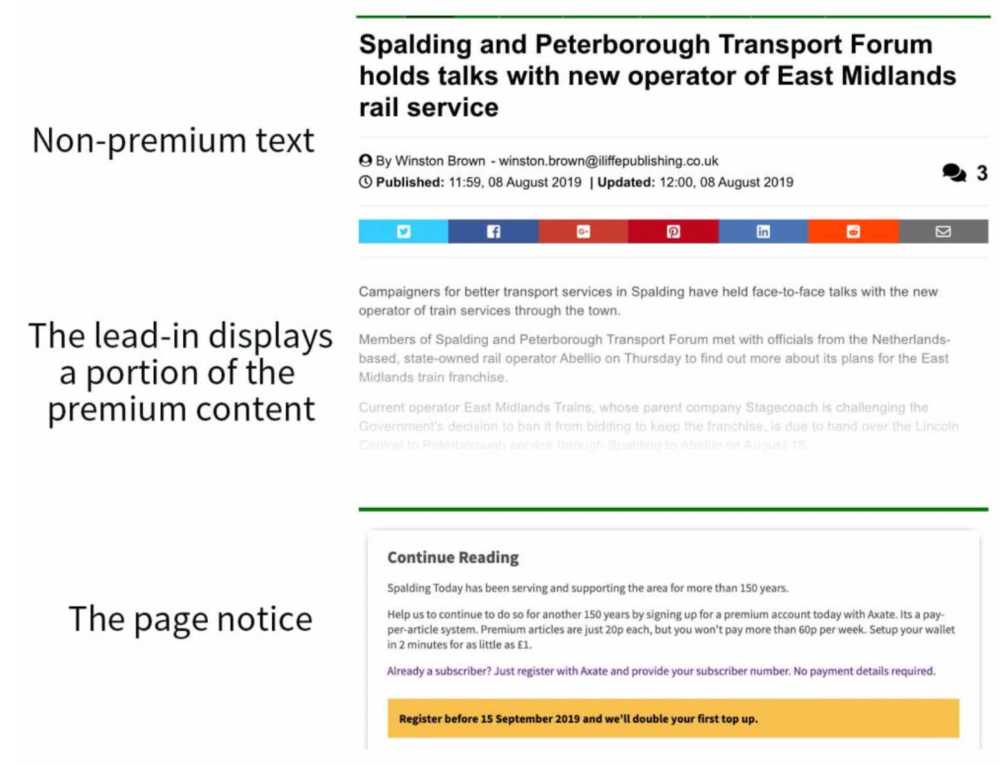

## Integrating with Axate

To get Axate to work on your site you need to add an Axate script to your web templates. This is what causes the Axate tab to appear on your pages.

To quickly get a sense, and try a quick demo, refer to this Codepen

* [https://codepen.io/justalex/pen/erZGqm](https://codepen.io/justalex/pen/erZGqm)

#### Adding the Axate script

With most publishers we start off by testing Axate on a staging version of their site (one they keep for internal development and testing and which isn’t available to the public). This allows us to test the integration with dummy accounts and data before we move to the live environment.  

This should be identical to your live site in terms of architecture and code

If you don’t have a staging site, then select 10 to 15 old / obsolete articles on your live site that are unlikely to be the subject of Google searches.

Adding the script is easy, there are two parts that ideally will go into the body tag, somewhere above your article: the configuration and the JavaScript bundle.  

```html
<script async src="https://wallet.axate.io/bundle.js"></script>

<div id="axate-wallet" 
data-selector-premium-content=".single-post .category-premium .entry .main-post-content " 
data-selector-in-page-notice=".axate-notice" 
data-selector-banner-contribution=".AxateContributionBanner">
</div>

# Axate Contribution Banner - Add this anywhere in the post. 

<div class="AxateContributionBanner"></div>


```
*Please note that the script uses the word “agate” not “axate”*


The configuration contains the premium class and Axate-notice class attributes.

* The script specifies that anything on the page that is attributed with the class “premium” will treated by Axate as a premium, paid-for article, i.e. it specifies the part of the page which contains the premium content.

* The element on the page that is attributed with the class “agate-notice” will be used to display a page notices to users embedded within your page by Axate. This is used for registration purposes, to display a “call to action” inviting the user to register for Axate. There are also other circumstances in which Axate needs to display a page notice. Wherever you put this element determines where the page notice will appear, and the lead-in will appear above it.

That’s the most technical bit done! The next step is to mark articles as premium...

#### Tagging articles

The way Axate works, publishers have complete control over which articles are charged for, and which are not. That means you need to tag them in your CMS so our system knows when to charge. Luckily this is very simple.

For every article that you wish to be treated as a premium, paid-for article, just include a tag that you have defined above as premium. Any articles without this tag will not be charged for.

For example:  

```html
<div class="story-non-premium">
  <h1> Title of the Story </h1>
</div>
<div class="premium"> 
   This is where the main content of the story resides,
   and will only be revealed to those who paid for it 
</div>
<div class="axate-notice"></div>
```

By way of illustration:




### Next Steps

2. [Providing an API for Content Retrieval](./content-api.md)
3. [Using WP-REST API (only for Wordpress)](./wordpress-api.md)
4. [Incorporating Subscribtions](./subscriptions-api.md)
