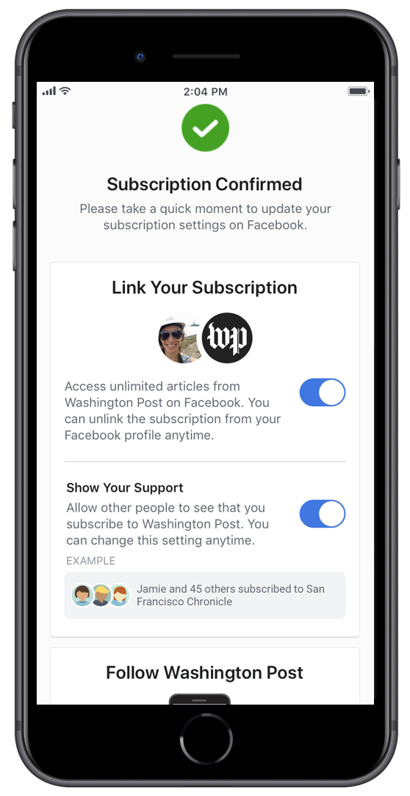

## Axate Facebook Instant Articles

> Please note: this is a research and development discovery document for future products and services, are a work in progress, and are subject to change. 

### Overview

To give readers and publishers more ways to use their Axate wallet, we're currently in the process of integrating Facebook Instant Articles. 

For more, see [Facebook Instant Articles](https://instantarticles.fb.com/). 

### Features

#### Facebook Instant Articles

* Fast to load and interactive (multimedia) articles
* Served on Facebook's platforms, on Facebook NewsFeeds
* Instantly sharable from within Facebook
* Flexible monetisation (with ads or third party payment mechanisms)
* Advanced analytics and insights

#### Axate's Facebook Instant Articles (TBA)

* Articles published to Facebook Instant Articles with Axate's pay on demand wallet
* Publishing to AMP and Facebook (TBC)

### Publishers
---

#### Setup

> TODO 
> - Complete discovery of setup instructions for publishers
> - Demo publication with Instant Articles enabled (for varied media sources)

1. Instant Articles requires a pre-existing [Facebook Page to sign up](https://developers.facebook.com/docs/instant-articles/). 
	* You may have multiple Facebook pages, so choose the relevant one to complete sign up.
2. Claim your URL by adding a `<meta property="fb:pages" />` tag to your template(s)
	* e.g. `<meta property="fb:pages" content="101010101010101" />`
3. Create article
	* This process is slightly easier [with WordPress](https://github.com/Automattic/facebook-instant-articles-wp/)
4. If it exists, connect your publications [RSS feed to your Facebook page](https://developers.facebook.com/docs/instant-articles/publishing/setup-rss-feed)

### Managing Content
---

> TODO - Describe FBIA "Publishing Tools" and workflows

### Integrating Axate
---

> Note: we are currently in the process of building out this functionality as a simplified version of our current Axate Wallet. Contact [publishers@axate.com](publishers@axate.com) to request more information (or for a future 'sneak peak').

### Further Information
---

#### Subscriptions

*Instant Articles*  

*Subscriptions*  
  

From [FB Journalism Project](https://facebookjournalismproject.com/article/testing-subscriptions-support-in-instant-articles/): 

> **If that person subscribes, the transaction will take place on the publisher’s website. The publisher will process the payment directly and keep 100% of the revenue.**

> The publisher and subscriber relationship will work the same way it does on their own sites today where the publisher has direct access and full control, including setting pricing and owning subscriber data.

> Similarly, someone who is already a subscriber to a publication in the test can authenticate that subscription within Instant Articles in order to get full access to that publisher’s articles.

### Troubleshooting

For an overview of testing, see: [Facebook Instant Articles Test and Debug](https://www.facebook.com/help/publisher/155533895103847).  

* Preview Articles with [Facebook Pages Manager](https://www.facebook.com/help/463079013702512)
* [Android](https://play.google.com/store/apps/details?id=com.facebook.pages.app)  
* [iOS](https://apps.apple.com/us/app/facebook-pages-manager/id514643583)  

### Sources 

* [Instant Articles](https://developers.facebook.com/docs/instant-articles)
* [Instant Articles API](https://developers.facebook.com/docs/instant-articles/api)

### Roadmap
---

> Axate will be partnering with CMS and technology providers in the near future. 
> For more information about being a technology partner, or any other technical queries, please contact <a href="mailto:dev@axate.com?subject=Integrate with Axate">dev@axate.com</a>
